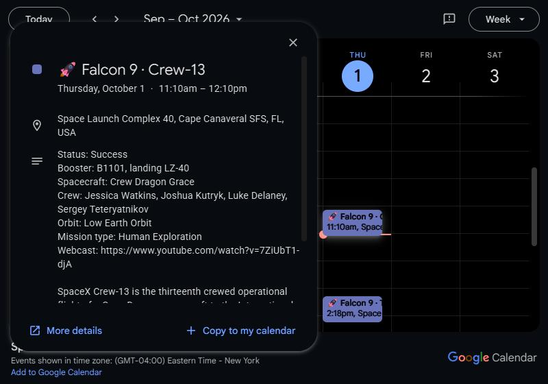
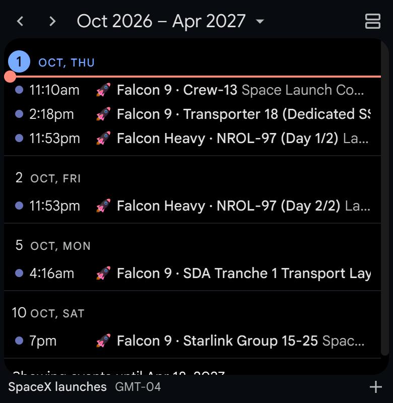

# launchcal: SpaceX launch calendar

[](https://github.com/launchcal/launchcal.github.io/actions/workflows/ci.yml)
[](https://github.com/launchcal/launchcal.github.io/actions/workflows/publish.yml)
[](https://buymeacoffee.com/roma321m)

A free, self-updating SpaceX launch calendar for Google Calendar, Apple Calendar (iPhone, iPad, Mac)
and Outlook. Subscribe once and every Falcon 9, Falcon Heavy, Starship and crewed Dragon launch,
reschedule and scrub shows up in your calendar, in your own time zone. Separate calendars cover
Starship flights only, crewed launches only, and everything except Starlink.

**Website: https://launchcal.github.io**

**Unofficial.** Not affiliated with, endorsed by, or connected to SpaceX.

<table>
  <tr>
    <td width="58%"></td>
    <td width="42%"></td>
  </tr>
  <tr>
    <td>Every launch carries the details: time, pad, booster and landing, crew, webcast.</td>
    <td>Upcoming launches on your phone, in your time zone.</td>
  </tr>
</table>

## Subscribe

| Calendar | What's in it | Google Calendar | Apple Calendar, Outlook, others (ICS) |
|---|---|---|---|
| SpaceX launches | Every launch with a known date: Falcon 9, Falcon Heavy, Starship | [Add](https://calendar.google.com/calendar/u/0?cid=MjRmNWFlMTgyNDJjMGJkODM2OThmOWVlNjRlYzJjYzJkYTE4NWNjNTM1NzcxOGVmZTNiYjFkMmQ4MDBjNDJiZkBncm91cC5jYWxlbmRhci5nb29nbGUuY29t) | `https://launchcal.github.io/cal/all.ics` |
| SpaceX crewed launches | Crew Dragon missions to the ISS and private crews | [Add](https://calendar.google.com/calendar/u/0?cid=Y2JjOGZkNDM2N2I3OTBjZjZlMThmYmY3OGFiYjkxOTExMmU1NDkzNjI1NGQzYjNiNmJkZmRkYTQ1ZWEzNzg2ZEBncm91cC5jYWxlbmRhci5nb29nbGUuY29t) | `https://launchcal.github.io/cal/crewed.ics` |
| Starship launches | Every Starship flight, test or operational | [Add](https://calendar.google.com/calendar/u/0?cid=YTcyZWE2OThkYmVjNWMzZmM3MTE0OGI5MjhkZDViMWMxMmZlZjI3Zjk4Njc2YmZlN2I0ZmNjNGVmNDQ0YTJmYUBncm91cC5jYWxlbmRhci5nb29nbGUuY29t) | `https://launchcal.github.io/cal/starship.ics` |
| SpaceX launches without Starlink | Everything except routine Starlink deployments (Starship flights stay in) | [Add](https://calendar.google.com/calendar/u/0?cid=YzE4ODQwMDZlMDQ2ZmJkNjIxYWZlODc1NmY2YjRlYzAwM2YyYWM5ZTk1OTBjYTM4MGY1MTFkZGVhYWIyNDQ3MEBncm91cC5jYWxlbmRhci5nb29nbGUuY29t) | `https://launchcal.github.io/cal/no-starlink.ics` |

- **Google Calendar:** click Add, then confirm. Updates arrive within about two hours.
- **Apple Calendar:** File → New Calendar Subscription, paste the ICS link. On iPhone: Settings → Calendar → Accounts → Add Account → Other → Add Subscribed Calendar (menu names vary by iOS version).
- **Outlook:** Add calendar → Subscribe from web, paste the ICS link.

The website's "Apple / Outlook" buttons open the subscribe dialog directly. ICS subscriptions refresh
on your app's schedule (Google: every 12 to 24 hours for ICS, which is why the native Google
calendars exist).

## What the events look like

- **Known time:** a one-hour event at liftoff, with the launch window, booster, landing, crew,
  orbit and webcast link in the description.
- **Only the day known:** an all-day event.
- **Not confirmed yet:** title ends in "(TBD)" and the event is tentative.
- **Only the month or year known:** left out until the date firms up.
- Events show as free time and carry no reminders; add your own to launches you want to watch.
- Flown launches keep their outcome. The ICS feeds keep them for 30 days after liftoff; the Google
  calendars keep them as history.

## How it works

Every two hours a [GitHub Actions workflow](.github/workflows/publish.yml):

1. fetches upcoming SpaceX launches and those of the last 30 days from
   [Launch Library 2](https://thespacedevs.com/llapi);
2. builds the four `.ics` feeds, the website and `next.json` (next launch for the countdown);
3. deploys them to GitHub Pages;
4. syncs the four public Google Calendars through the Calendar API with a service account,
   updating events in place by launch id, so a reschedule edits the event instead of duplicating it.

If the data source is down, nothing is published and the last good version stays live.

## Development

Requires Node 24 or newer. Node runs the TypeScript in `src/` directly; there is no build step for the code.

```bash
npm ci
npm test
npm run typecheck
npm run fetch   # calls the live API, writes data/snapshot.json
npm run build   # writes site/cal/*.ics, site/index.html and site/next.json
```

Serve `site/` with any static file server to preview the website. `npm run sync` writes to Google
Calendar and needs a service account key (`GOOGLE_SERVICE_ACCOUNT_KEY_FILE`); use `--dry-run` to
only print the changes, and `--calendar all=<calendarId>` to sync one calendar into a test calendar.

| Path | What it does |
|---|---|
| `src/ll2.ts`, `src/fetch.ts` | Launch Library 2 client and fetch entry point |
| `src/calendars.ts` | The four calendars, their filters and Google calendar ids |
| `src/event.ts` | Event text and timing, shared by ICS and Google |
| `src/ics.ts`, `src/build.ts` | ICS writer and build entry point |
| `src/gcal.ts`, `src/google.ts`, `src/sync.ts` | Google Calendar diff, API client and sync entry point |
| `src/page.ts`, `src/page.html`, `site/` | Website template and static assets (`site/img/screens/` holds the screenshots) |

## Data and credits

- Launch data: [Launch Library 2](https://thespacedevs.com/llapi) by The Space Devs. The data is
  theirs and subject to their terms; the MIT license covers launchcal's code only.
  Wrong launch data? Report it to The Space Devs so every consumer gets the fix.
- Website photo: CRS-20 launch, NASA/Tony Gray and Tim Terry. NASA does not endorse this project.
- Typeface: D-DIN by Datto, under the SIL Open Font License 1.1.

See the [terms of use](https://launchcal.github.io/terms.html) and
[privacy policy](https://launchcal.github.io/privacy.html) (no cookies, no tracking).

## Support

launchcal is free and ad-free. If it helps you catch a launch, you can
[buy me a coffee](https://buymeacoffee.com/roma321m).

## Contributing

See [CONTRIBUTING.md](CONTRIBUTING.md). Report security issues privately, see [SECURITY.md](SECURITY.md).

## License

[MIT](LICENSE)
